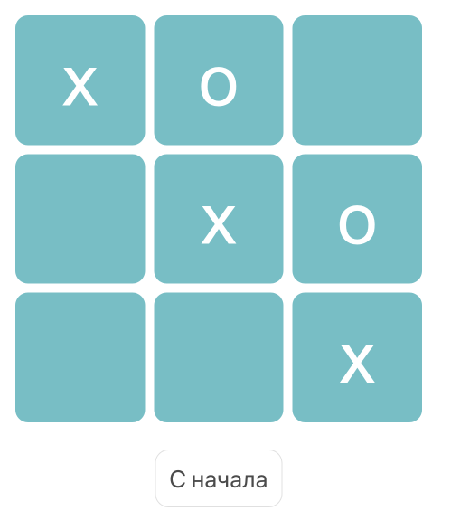

# Дипломная работа по курсу «Основы программирования»

В качестве дипломной работы реализована игра «крестики-нолики». 

Игроки по очереди ставят крестики и нолики. Игрок, первый заполнивший диагональ, вертикаль или горизонталь своими символами, выигрывает.

## Из чего состоит проект?

Проект состоит из файла `logic.js` в котором описана логика игры и из файлов `index.html`, `styles.css`, `ui.js`.